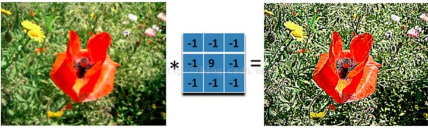
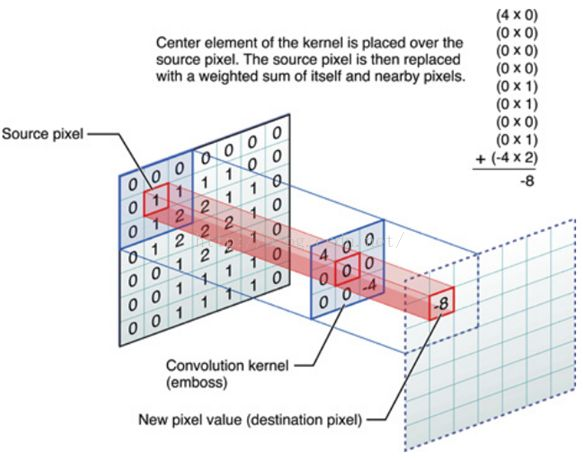
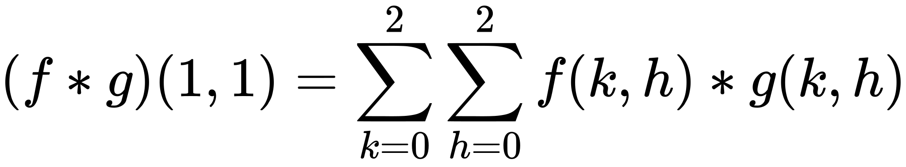

# lab 8

    本节目标：
      1. 理解神经网络中的矩阵卷积和池化操作
      2. 实现神经网络中的矩阵卷积和池化操作

## 获取及提交lab

**获取**：通过 `https://github.com/C-FUDAN-2020/lab8` 获取。

**提交物**：将你完成目标 2 的源代码文件作为 lab8 的提交物。

**提交**：将提交物文档命名为学号_姓名 （如20302010000_王明），提交至超星学习通对应的作业中。

**截止时间**：北京时间 2020年11月15日 23:59:59 

## 矩阵卷积（Convolution）

什么是卷积？美颜软件中对图片的锐化，磨皮操作就是卷积的一种应用。

具体而言，如下图所示：



中间的矩阵（二维数组）称为`卷积核`

图片本质上是一个二维数组，数组中的每个数据表示图片上的像素点的信息。

因此上图的运算实际如下图所示



最左边就是我们原始输入图像了，中间呢是卷积核，-8 就是卷积的结果。

上图实际上是计算各个位置上的数字相乘之和，公式如下:



`f` 是原始输入图像，`g` 是卷积核。

上面只是计算一个像素的流程，整体流程如下图所示：


最后，发现计算出的新矩阵维数比原始矩阵要小，这就是卷积作用，它提取了原始图像的特征。

如果我们还希望输入和输出的维数保持一致，可以引入填充 (Padding) 操作，但这不是我们这节课的内容，感兴趣的同学可以在课后自行了解。

## 矩阵池化（Pooling）

池化（Pooling）是卷积神经网络中另一个重要的概念，它实际上是一种形式的降采样。有多种不同形式的非线性池化函数，而其中“**最大池化（Max pooling）**”是最为常见的。它是将输入的图像划分为若干个矩形区域，对每个子区域输出最大值。直觉上，<strong>这种机制能够有效地原因在于，在发现一个特征之后，它的精确位置远不及它和其他特征的相对位置的关系重要。池化层会不断地减小数据的空间大小，因此参数的数量和计算量也会下降，这在一定程度上也控制了过拟合。</strong>通常来说，CNN的卷积层之间都会周期性地插入池化层。

池化层通常会分别作用于每个输入的特征并减小其大小。当前最常用形式的池化层是每隔 `2` 个元素从图像划分出 `2*2` 的区块，然后对每个区块中的4个数取最大值。这将会减少 `75%` 的数据量。


池化层的引入是仿照人的视觉系统对视觉输入对象进行降维和抽象。在卷积神经网络过去的工作中，研究者普遍认为池化层有如下三个功效：

1. 特征不变形：池化操作是模型更加关注是否存在某些特征而不是特征具体的位置。

2. 特征降维：池化相当于在空间范围内做了维度约减，从而使模型可以抽取更加广范围的特征。同时减小了下一层的输入大小，进而减少计算量和参数个数。

3. 在一定程度上防止过拟合，更方便优化。

## 代码实现

我们给定如下数据，请大家使用 C 语言编写两个源代码 ` convolution.cpp ` 和 ` pooling.cpp ` 分别实现卷积与池化运算。

```c
// 原始数据（用于卷积和池化）
[
  [0, 0, 1, 0, 0, 2, 4, 6, 6, 4, 8, 10],
  [0, -2, 0, 0, 0, 2, 4, 0, 6, 0, 1, 0],
  [2, 0, 1, 0, 7, 0, 0, 3, 0, 0, -4, 10],
  [0, 0, -1, 9, 0, 2, 1, 5, 6, 0, 0, 1],
  [0, 0, 2, 0, -4, 4, 0, -6, 6, 4, 8, 0],
  [0, 1, 1, 0, 0, -2, 1, 12, 0 7, 1, 0],
  [1, 0, 1, 0, -5, 0, 13, 6, 0, 0, 0, 0],
  [0, 0, 0, 2, -1, 0, 4, 6, 0, 2, 0, 0],
  [0, 0, 0, 0, 0, 0, 0, 0, 0, -1, 0, 0],
  [0, 0, 0, -3, 0, 0, 0, 0, 0, 4, 0, 1],
  [0, 60, 0, 0, 0, 0, 3, 0, 0, 0, -1, 0],
  [0, 40, 100, -1, 0, 1, 0, 0, 0, 0, 0, 0]
]
// 卷积核（用于卷积）
[
  [0, -1, 0],
  [-1, 5, -1],
  [0, -1, 0]
]
```

## Reference

[1] LeCun Y, Bottou L, Bengio Y, et al. Gradient-based learning applied to document recognition[J]. Proceedings of the IEEE, 1998, 86(11): 2278-2324.

[2] https://zh.wikipedia.org/wiki/%E5%8D%B7%E7%A7%AF%E7%A5%9E%E7%BB%8F%E7%BD%91%E7%BB%9C

[3] https://mlnotebook.github.io/post/CNN1/
